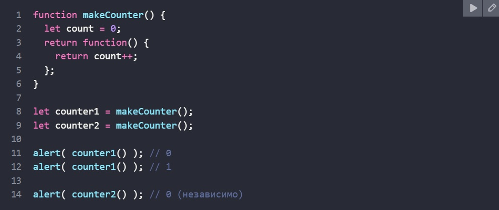

## 11.02.2023
### **## Основное:**
Немного выпала из обоймы с релизом Hogwarts Legacy :)

Но вообще, должна доложить, что я закончила последнее задание из раздела **Intermediate Algorithm Scripting**, а именно [Map the Debris](https://www.freecodecamp.org/learn/javascript-algorithms-and-data-structures/intermediate-algorithm-scripting/map-the-debris "Map the Debris - freeCodeCamp")

[Котино решение](./codePurgatory/codeForSave.md#map-the-debris "Kotya's solution")

Пока вставляла ссылки, меня тут осенило, что, наверное, надо было его через .map() делать. Хотя я и так собиралась переделать через .map() или .reduce(), чтобы было православно. Пока что через .forEach(), но работает)

Ой, и еще пожаловаться хотела, на задание - там еще попробуй формулу до ума доведи, чтобы реализацию потом делать. Ужас! (Формулу нашла в интернете. Не раскаиваюсь.)
****
### **## Не по теме:**
"Оговорочка по Фрейду" на английском будет "Freudian slip". Забавно!

Hogwarts Legacy. Игра, конечно, шикарная... На максимальных настройках, наверное, вообще красота неописуемая! И котиков можно гладить)) Жалко они им имена не дали.
****
****
## 02.02.2023
### **## Основное:**
Решила задачку [Make a Person](https://www.freecodecamp.org/learn/javascript-algorithms-and-data-structures/intermediate-algorithm-scripting/make-a-person "Make a Person - freeCodeCamp").

[Котино решение](./codePurgatory/codeForSave.md#make-a-person "Kotya's solution")

Я и вчера не отлынивала, просто все время что-то было не так: то **bob instanceof Person** не true, то **Object.keys(bob).length** не 6.
В общем, чтобы свойство оставалось доступным только внутри функции, нужно объявлять его там с помощью let, т.к. если сделать это через this - оно будт доступно напрямую. Что происходит внутри функции - остается внутри функции, как-то так...
****
### **## Не по теме:**
Спать хочу, погибаю...

Оказывается существует легенда по которой княгиня Ольга была простолюдинкой из Пскова и работала на речной переправе. Т.е. с веслом на лодке людей перевозила. Какой же это у нее плечевой пояс должен был быть? 

Ну так вот, князь Игорь по каким-то своим делам в тех краях был и через эту самую реку переправиться изволил, и пока плыли, от нечего делать, по сторонам все вокруг разглядывал и внезапно осознал, что лодкой девица правит. И, как пишет летопись: "тотчас же разгорелся желанием" хD Формулировочки, однако!

В общем, начал к Ольге приставать, а та его так грамотно осадила, что все глупости у него из головы вылетели. Она ему сказала что-то вроде, мол, думаешь если князь, так можно любой понравившейся девицы добиваться? Да я лучше тут утоплюсь, чем честь свою запятнаю. И видать так она ему в память запала, что когда время жениться пришло, он за ней Олега и отправил.

А, еще! Просто, чтобы запомнить: при Святославе Игоревиче Киев осаждали печенеги, воеводу местного гарнизона вне Киева Претич звали.
****
****
## 30.01.2023
### **## Основное:**

Да Боже ж мой! Откуда я могла знать про этот **arguments.length** ?! Кстати, я таки решила эту задачку!

[Arguments Optional](https://www.freecodecamp.org/learn/javascript-algorithms-and-data-structures/intermediate-algorithm-scripting/arguments-optional "Arguments Optional - freeCodeCamp")

[Котино решение](./codePurgatory/codeForSave.md#arguments-optional "Kotya's solution")

Да, я знаю, что это ад кромешный, но оно наконец-то заработало! Собираюсь его переделать, а потом посмотреть, как нормальные люди это решали в ответах на **freeCodeCamp**.

****
### **## Узнала нового:**
**~ Markdown:**

Ссылка на заголовок в другом *.md файле выглядит так(# нужен только ОДИН):
```md
[Название](./файл.md#заголовок "Всплывающая подсказака")
```
А еще можно оформить код и подсветить синтаксис в блоке! Название языка можно изменять.
```md
    ```js

    ```
```

**~ JS:**

И вот, наконец, я узнала про многострочные коментарии /* текст */. Я встречала такую запись <-- но для js она не работала -->

А еще в консоли Chrom'а можно писать код в несколько строк использую Shift + Enter, чтобы он сразу не исполнялся! Вот это да! Да? 

**~ Else:**

Есть языки программирования, которые не позволяют менять значение переменной. Ну, то есть, вообще. Надо новое значение - создавай новую переменную, салага!
Для примера говорили о языках Scala и Erlang. Надо будет подумать и почитать об это для развития кругозора.

****
****
## 29.01.2023
### **## Основное:**

Да уж... Отключения света и детеныш возрастом 2,5 могут много изменить в планах на ночную учебу. Сегодня дала себе пинка, но видимо мало! Мало поработала! Коте неуд за сегодня!
****

Прочитала статью про замыкания и лексическое окружение. Вроде бы все понятно, но какой-то зуд под черепной коробкой намекает, что-то еще не доконца мне открылось. Надо будет вернуться и перечитать через время.

Кусочек кода хорошо илюстрирующий изолированность лексического окружения функции.



Еще пыталась решить задачку [Arguments Optional](https://www.freecodecamp.org/learn/javascript-algorithms-and-data-structures/intermediate-algorithm-scripting/arguments-optional "Arguments Optional - freeCodeCamp").  
Вернее все еще пытаюсь. Именно отсюда и стартовал мой путь к замыканиям. С решением это пока не помогло.

Решение не работает для случаев:

addTogether(5)(7) should return 12

addTogether(2)([3]) should return undefined

Еще подумаю на этим сегодня после того, как посплю. 4 утра уже, как-никак.

****

### **## Ссылки:**
&emsp;&emsp;[Замыкания - JAVASCRIPT.RU](https://learn.javascript.ru/closure "Всплывающая подсказка")

****
### **## Не по теме:**
Боже мой, что происходит в мире? Иран горит, землетрясение, атака Израиля... А ты всего-то хотела почитать статью по JS не отвлекаясь.

****
****

## 26.01.2023
### **## Основное:**

Сегодня я вспомнила немножко базового Git и создала этот чудесный репозиторий.

Но сейчас только 4 утра, поэтому я постараюсь сделать что-то действительно полезное, хоть, скорее всего, и небольшое.
****
### **## ? ? ?:**
А как лучше будет: публиковать новые записи сверху или снизу? Хм...
****
****