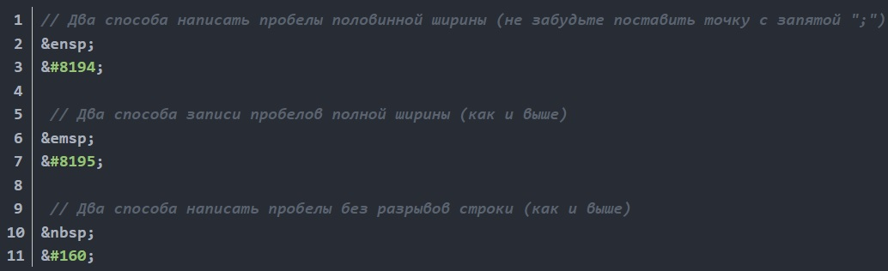

# **Just a Study Diary to make me work** =) RU

It would be something like that...

### **Main part(bla-bla-bla):**

Today I was nice cat and watched newbie HTML lessons for 2 hours.
****
### **Specific part (what I learn today about):**

**HTML :** it means HyperText Markup Language! 

**CSS :** current version 3

**JS :** this is where I'm going to

**Git :** I did this Diary on Git!

**Related technologies :** There's OSI model
****

### **Links and usefull stuff:**

https://habr.com/ru/post/120652/
Article about slash snd backslash
****
### **Useless but interesting (: **

There are multiple sunrise and sunsets effects on Mercury.  It looks like Sun is rising(downing) then it stops and all playing backwards, then sun rises(downs) again. It called Joshua Effect(Эффект Иисуса Навина), biblical character that stopped sun movement.

****
****
**

Dummy**

## Дата
****
### **# Основное:**

Текст
****
### **# Узнала нового:**
**~ HTML:**

текст

**~ CSS:**

**~ Else:**
****
### **# Ссылки:**
&emsp;&emsp;[Текст ссылки](адрес "Всплывающая подсказка")

****
### **# Не по теме:**
текст

****
### **~ ~ How to insert img(local link):**

<!--   -->

<!-- 
 -->

Dummy pic

****

### **~ ~ Color palette:**

**#2155CD Unused yet**

**#0AA1DD Header ###**

**#79DAE8 Emphasized text **

****

